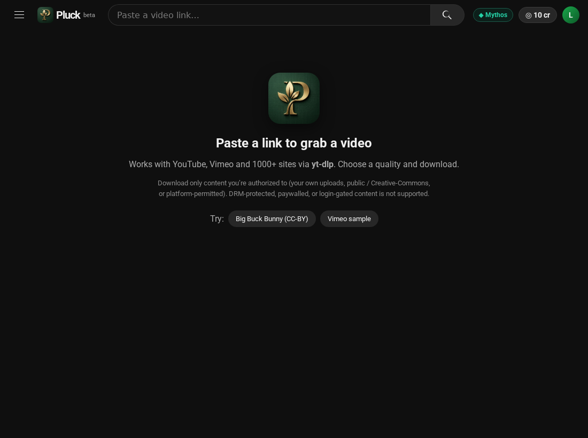
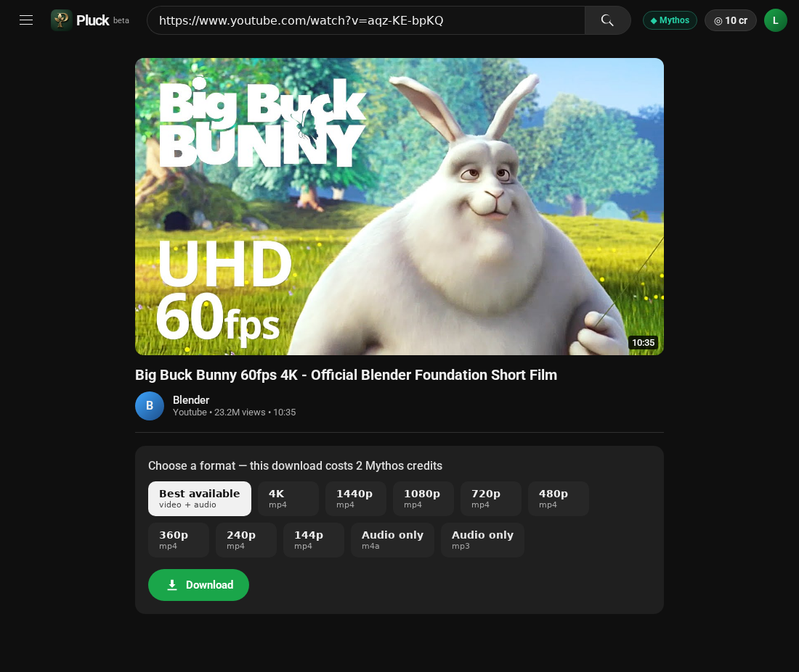
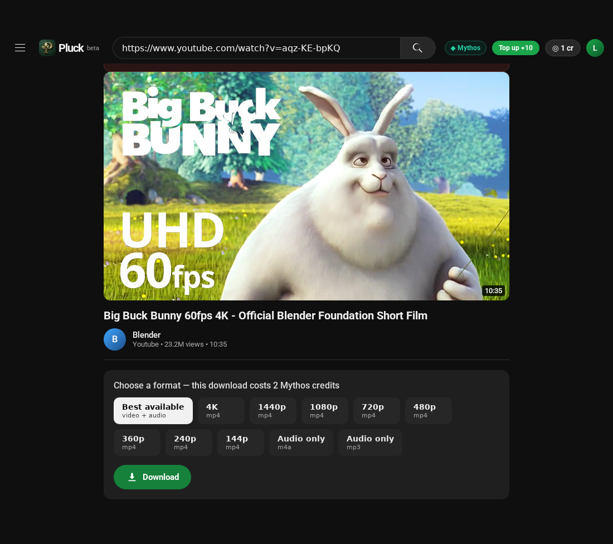

# Pluck

A clean, **YouTube-styled** front-end over [`yt-dlp`](https://github.com/yt-dlp/yt-dlp) — paste a link,
pick a quality, download. FastAPI backend, vanilla JS front-end, dark YouTube look.



## Mythos Producer mode (metered auth + payment)
Pluck is also wired to the **Mythos SDK** (`mythos-sdk`), making it a working
**Mythos Producer**: a Consumer launches it from Mythos (launch-token **auth**), and each download spends
credits from their Mythos wallet (**payment** via `report_usage`). Config is in `server.py`
(`MYTHOS_API_URL`, `MYTHOS_LISTING_ID`, `CREDITS_PER_DOWNLOAD`).

Run the metered demo (needs the mock Mythos backend):
```bash
(cd ../Mythos/mythos-sdk-demo/mock-mythos-backend && npm install && npm start)   # :4000
python server.py                                                                  # :8000
# open http://localhost:4000  ->  "Open Pluck"  (mints a launch token, redirects in)
```

Verify auth & payment:
| Check | Expected |
|---|---|
| open `:8000` directly (no launch) | "Launch from Mythos" — denied |
| launch via `:4000/open/pluck` | authenticated (`/api/session` → user + balance) |
| re-open the same `?lt=` token | 401 — single-use (`/consume` 409) |
| tampered / expired token | 401 |
| download a video | wallet debited (mock logs `meter … -2 (video-download)`) |
| download with too few credits | 402 "Out of credits" → **Top up** |


## Scope (please read)
Pluck downloads content you're **authorized** to download — your own uploads, public /
Creative-Commons, or platform-permitted videos — across the 1000+ sites yt-dlp supports.
It does **not** circumvent DRM, logins/paywalls, or anti-bot protection (yt-dlp doesn't either, and
circumventing DRM specifically runs into DMCA §1201). DRM-protected / paywalled streams won't work.

## How it works
- **Metadata:** `yt-dlp` `extract_info` → title, channel, duration, thumbnail, and a curated quality ladder.
- **Download:** a background job runs yt-dlp with the chosen format; separate video+audio streams are
  merged by **ffmpeg** (bundled via `imageio-ffmpeg`, no system install needed).
- **Full YouTube formats** use a JS runtime (`deno`, installed to `~/.deno`).
- Progress is polled from `GET /api/jobs/{id}`; the finished file is served by `GET /api/file/{id}`.

## Run
```bash
python3 -m venv .venv && . .venv/bin/activate
pip install -r requirements.txt
# one-time, for full YouTube format extraction:
curl -fsSL https://deno.land/install.sh | sh -s -- -y
python server.py            # http://localhost:8000
```

## API
| Endpoint | Purpose |
|----------|---------|
| `POST /api/info {url}` | metadata + available qualities |
| `POST /api/download {url, choice}` | start a download job → `{job_id}` |
| `GET /api/jobs/{id}` | job status / progress / speed / filename |
| `GET /api/file/{id}` | download the finished file |

`choice` is `best`, a height (`2160`…`144`), `audio-m4a`, or `audio-mp3`.

## Screenshots
| Result (watch-page) | Download + progress |
|---|---|
|  |  |
