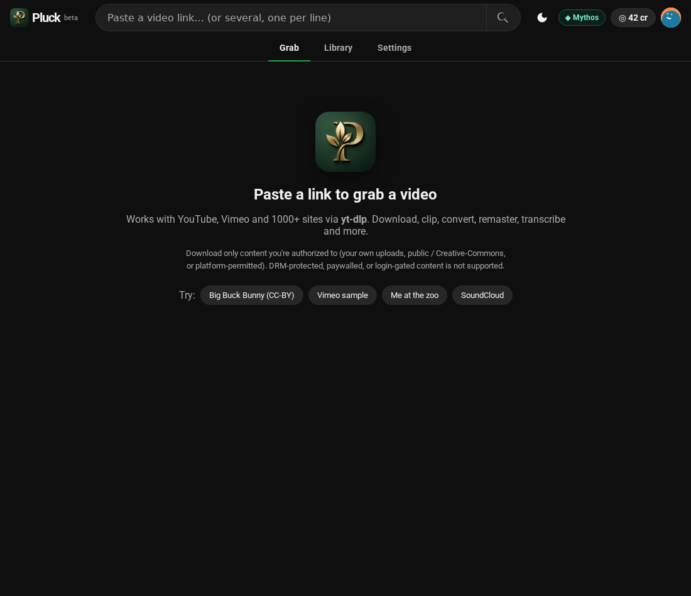
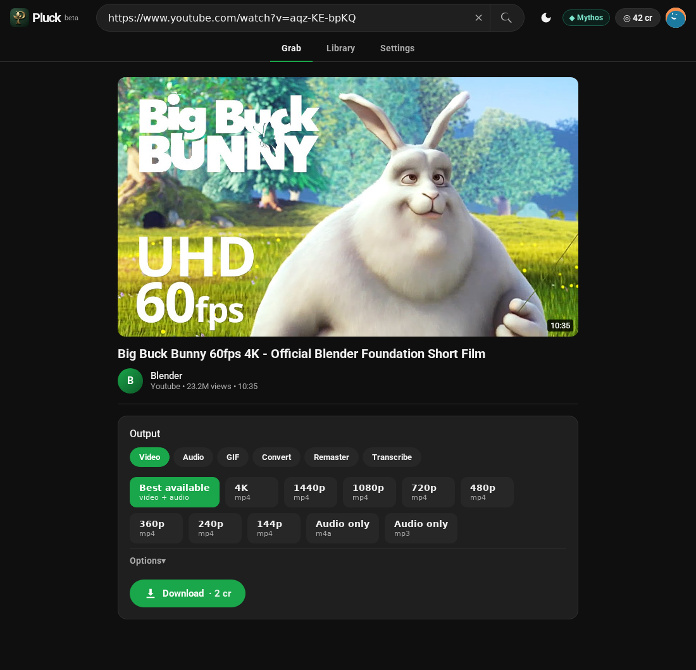
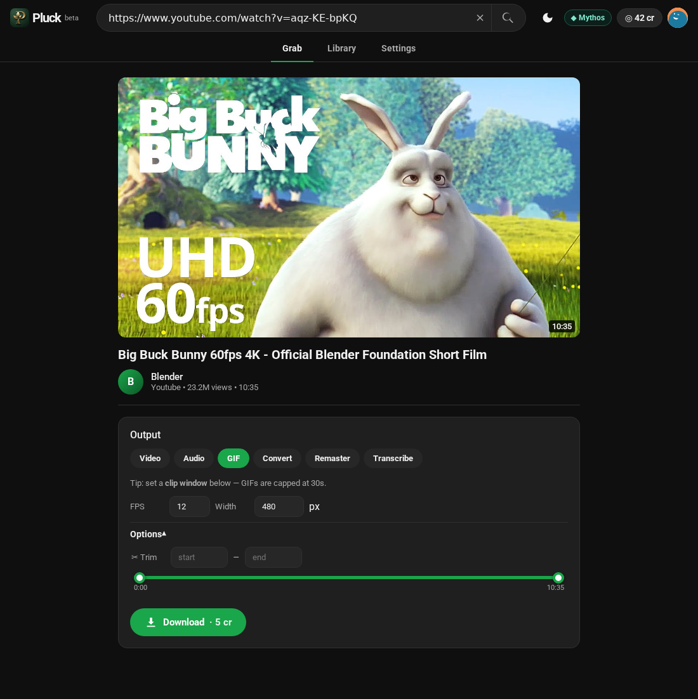
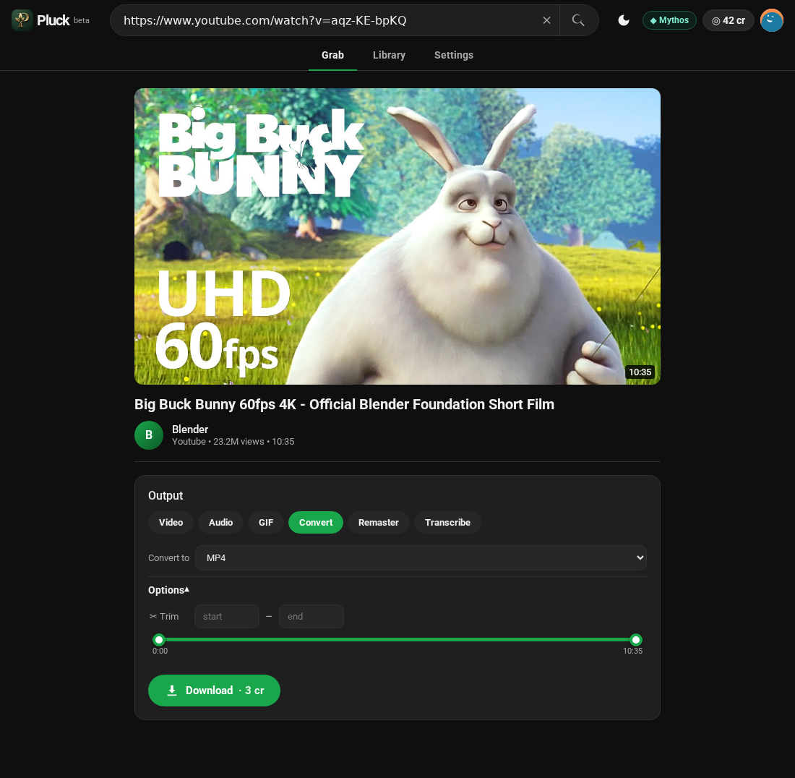
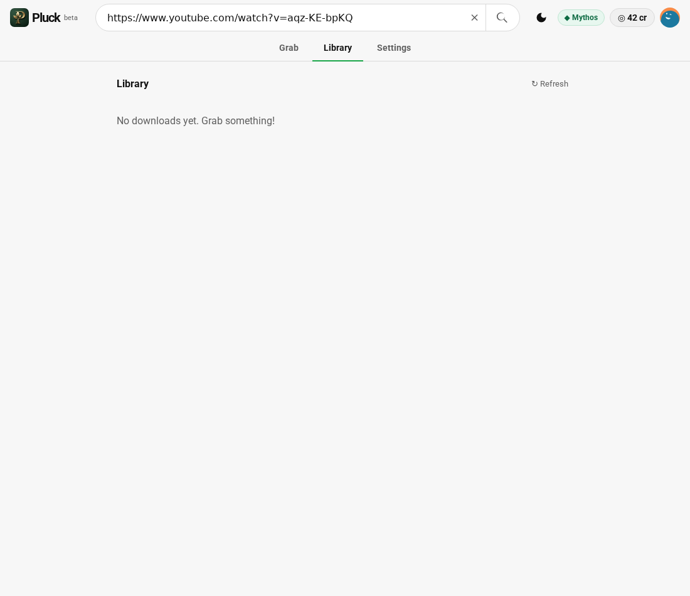

# Pluck

A clean, **YouTube-styled** front-end over [`yt-dlp`](https://github.com/yt-dlp/yt-dlp) — paste a link,
pick an output (video / audio / GIF / convert / chapters / remaster / transcribe / stems), download.
FastAPI backend (a modular `pluck/` package), ES-module front-end, dark *and* light themes.



## Mythos Producer mode (metered auth + payment)
Pluck is also wired to the **Mythos SDK** (`mythos-sdk`), making it a working
**Mythos Producer**: a Consumer launches it from Mythos (launch-token **auth**), and each download spends
credits from their Mythos wallet (**payment** via `report_usage`). Config is in `server.py`
(`MYTHOS_API_URL`, `MYTHOS_LISTING_ID`, `CREDITS_PER_DOWNLOAD`).

Run the metered demo (needs the mock Mythos backend):
```bash
(cd ../Mythos/mythos-sdk-demo/mock-mythos-backend && npm install && npm start)   # :4000
python server.py                                                                  # :8000
# open http://localhost:4000  ->  "Open Pluck"  (mints a launch token, redirects in)
```

Verify auth & payment:
| Check | Expected |
|---|---|
| open `:8000` directly (no launch) | "Launch from Mythos" — denied |
| launch via `:4000/open/pluck` | authenticated (`/api/session` → user + balance) |
| re-open the same `?lt=` token | 401 — single-use (`/consume` 409) |
| tampered / expired token | 401 |
| download a video | wallet debited (mock logs `meter … -2 (video-download)`) |
| download with too few credits | 402 "Out of credits" → **Top up** |



## Node twin (`node/`)
The same app, ported 1:1 to **Node.js + Express** and integrated with the **Mythos Node SDK**
(vendored at `vendor/packages/node`, alongside the Python SDK at `vendor/packages/python`).
Same routes, same frontend, same SQLite job model, same pricing — run either server.
See [node/README.md](./node/README.md):
```bash
cd node && npm install && npm start          # :8000  (PORT=8001 to run beside the Python app)
```

## Scope (please read)
Pluck downloads content you're **authorized** to download — your own uploads, public /
Creative-Commons, or platform-permitted videos — across the 1000+ sites yt-dlp supports.
It does **not** circumvent DRM, logins/paywalls, or anti-bot protection (yt-dlp doesn't either, and
circumventing DRM specifically runs into DMCA §1201). DRM-protected / paywalled streams won't work.

## How it works
- **Metadata:** `yt-dlp` `extract_info` → title, channel, duration, thumbnail, and a curated quality ladder.
- **Download:** a background job runs yt-dlp with the chosen format; separate video+audio streams are
  merged by **ffmpeg** (bundled via `imageio-ffmpeg`, no system install needed).
- **Full YouTube formats** use a JS runtime (`deno`, installed to `~/.deno`).
- Progress is polled from `GET /api/jobs/{id}`; the finished file is served by `GET /api/file/{id}`.

## Premium features (metered via Mythos)
Each premium option adds Mythos credits (insufficient → 402 → Top up). Pick an **output mode**
(Video / Audio / GIF / Convert / Chapters / Remaster / Transcribe / Stems) on the result view, then
fine-tune with the **Options** panel; the credit cost updates live (driven by `GET /api/pricing`, so
the client estimate never drifts from the server charge). Full tiered plan: [`docs/roadmap.md`](./docs/roadmap.md).

| Feature | What it does | + credits |
|---|---|---|
| Trim | download just `start–end` (a clip) | +1 |
| 4K / 8K | guaranteed hi-res multiplexing | +2 / +4 |
| Subtitles | `.srt` written + embedded | +1 |
| Music mode | MP3 + ID3 tags + album art + loudness | +1 |
| SponsorBlock | cut sponsor / intro / outro segments | +1 |
| **Clip → GIF** | clip window → high-quality palette GIF (fps/width) | +3 |
| **Convert** | remux/transcode → mp4/mkv/webm/mp3/m4a/opus/wav/flac | +1 |
| **Chapter split** | split by the video's chapters → `.zip` | +2 |
| **Remaster** | denoise (`afftdn`) + loudness-normalize the audio | +2 |
| **Transcribe** (Whisper) | AI transcript → `.srt` + `.txt` *(optional dep)* | +8 |
| **Stems** (Demucs) | split into vocals / drums / bass / other → `.zip` *(optional dep)* | +15 |
| Bulk playlist + filter | playlist/channel → filter (min-mins / keyword) → `.zip` | 2 / video |
| **Multi-URL grab** | paste many links → one charged job each | 2 / link |
| Multi-threaded speed | parallel fragments | free |

> **Optional ML features** (Transcribe, Stems) need heavy dependencies. Install them with
> `pip install -r requirements-ml.txt`. Without them the app still runs — `GET /api/capabilities`
> reports what's available and the UI hides the rest.

Downloads are **persisted in SQLite** (`pluck.db`): the **Library** tab shows your history across
restarts, and a job interrupted by a restart is shown as such (rather than polling a dead job).

| Output modes + options | Convert mode |
|---|---|
|  |  |

## Run (standalone — no Mythos)
```bash
python3 -m venv .venv && source .venv/bin/activate
pip install -r requirements.txt
# one-time, for full YouTube format extraction:
curl -fsSL https://deno.land/install.sh | sh -s -- -y
python -m uvicorn server:app --host 127.0.0.1 --port 8000 --reload
```
Open `http://localhost:8000`. Without a Mythos launch you'll see the "Launch from Mythos" gate and
all `/api/*` calls return **401** — that's the auth gate working. For the full auth + payment flow
(and to actually use the app), launch via the Mythos mock below.

## Local development with Mythos mock (full auth + payment)

Pluck's auth and payment only activate when a mock Mythos backend issues the launch token.
Run both services, then **enter via Mythos** — not by opening Pluck directly.

**Terminal 1 — mock Mythos (port 4000)**
```bash
cd Mythos/mythos-sdk-demo/mock-mythos-backend
npm install            # first time only
node server.mjs
# → Mock Mythos listening on http://localhost:4000
```

**Terminal 2 — Pluck (port 8000)**
```bash
cd pluck
python3 -m venv .venv && source .venv/bin/activate
pip install -r requirements.txt
pip install -e vendor/packages/python   # vendored Mythos Python SDK (not on PyPI yet)
python -m uvicorn server:app --host 127.0.0.1 --port 8000 --reload
```

**Browser — enter via Mythos**
```
http://localhost:4000/open/pluck
```
Mythos mints a single-use RS256 launch token and redirects to
`http://localhost:8000/dashboard?lt=<jwt>`. You land on the Pluck dashboard as
**Linus Pauling** (`linus@consumer.example`) with **10 credits**.

> Opening `localhost:8000` directly (no `?lt=`) shows "Launch from Mythos" and all API calls
> return **401** — the auth gate is working correctly.

### Verify auth & payment
| Check | Expected |
|---|---|
| `GET /api/session` before launch | 401 |
| After `localhost:4000/open/pluck` | `{"user":"Linus Pauling","balance":10,...}` |
| Re-use same `?lt=` token | 401 — single-use (`/consume` 409 on replay) |
| Tampered / expired token | 401 |
| Download (2 cr base) | balance decrements, mock logs `meter … -2` |
| Trim + music + subs (5 cr extra) | 402 once balance exhausted |
| Click **Top up +10** | balance restored |

### Fault injection (mock-backend test endpoints)
```bash
# Rotate JWKS signing keys — SDK must re-fetch and still verify
curl -X POST http://localhost:4000/__keys/add

# Mint a custom token (expired, wrong aud, etc.) — Pluck must reject it
curl -X POST http://localhost:4000/__mint \
  -H "Content-Type: application/json" \
  -d '{"sub":"user-pluck-001","expOffsetSec":-1}'
# paste the returned token as ?lt=<token> → expect 401

# Top up wallet directly
curl -X POST http://localhost:4000/api/wallet/topup \
  -H "Content-Type: application/json" \
  -d '{"userId":"user-pluck-001","amount":20}'

# Check wallet balance
curl http://localhost:4000/api/wallet/user-pluck-001
```

## API
| Endpoint | Purpose |
|----------|---------|
| `POST /api/info {url}` | metadata + available qualities (+ chapters) |
| `POST /api/download {url\|urls, choice, output, convert_to, gif_fps, gif_width, start, end, subs, music, remaster, sponsorblock, playlist, min_minutes, keyword}` | start single / multi-URL / playlist jobs → `{job_id, charged}` or `{jobs:[…]}` |
| `GET /api/jobs` | this user's job history (Library) |
| `GET /api/jobs/{id}` | job status / progress / speed / filename |
| `DELETE /api/jobs/{id}` | cancel a running job |
| `GET /api/file/{id}` | download the finished file |
| `GET /api/session` | user + wallet balance |
| `POST /api/topup` | add 10 credits (dev/mock) |
| `GET /api/pricing` | credit price table (client live-cost source of truth) |
| `GET /api/capabilities` | which optional features (whisper/demucs) are installed |

`choice` is `best`, a height (`2160`…`144`), `audio-m4a`, or `audio-mp3`.
`output` is `video` (default), `audio`, `gif`, `convert`, `chapters`, `remaster`, `transcript`, or `stems`.

## Architecture
The backend is a `pluck/` package (the entry `server.py` is a thin shim re-exporting `pluck.app:app`):

| Module | Responsibility |
|---|---|
| `pluck/config.py` | env, paths, constants (sets Mythos env before the SDK loads) |
| `pluck/app.py` | FastAPI factory: middleware, routers, static mount, startup |
| `pluck/db.py` | SQLite job persistence (WAL, connection-per-thread) |
| `pluck/jobs.py` | `JobQueue` — thread pool + DB-backed lifecycle, dedup/cache, restart recovery, reaper |
| `pluck/pricing.py` | `cost_for()` + `PRICING` — the single source of truth for credits |
| `pluck/mythos.py` | the AUTH gate (`consumer()`) + wallet helpers |
| `pluck/ytdlp.py` | yt-dlp option builders, quality ladder, metadata extraction, caches |
| `pluck/capabilities.py` | optional-dependency detection (Whisper / Demucs) |
| `pluck/pipelines/*` | one runner per output mode (`download`, `playlist`, `gif`, `convert`, `chapters`, `remaster`, `transcribe`, `stems`) over a shared `base.JobCtx` |
| `pluck/routes/*` | `pages`, `session`, `info`, `download`, `jobs` routers |

Frontend: ES modules under `static/js/` (`api`, `store`, `toast`, `session`, `trim`, `result`,
`playlist`, `jobs`, `batch`, `settings`, `main`) + a token-driven themed `static/styles.css`.

Tests: `pytest` (`tests/`) — pricing, DB, yt-dlp helpers, ffmpeg pipelines (against a locally
generated clip, no network), and route/auth/charging via `TestClient`. Run with `python -m pytest`.

## Screenshots
| Result (watch-page) | Download + progress |
|---|---|
|  |  |
