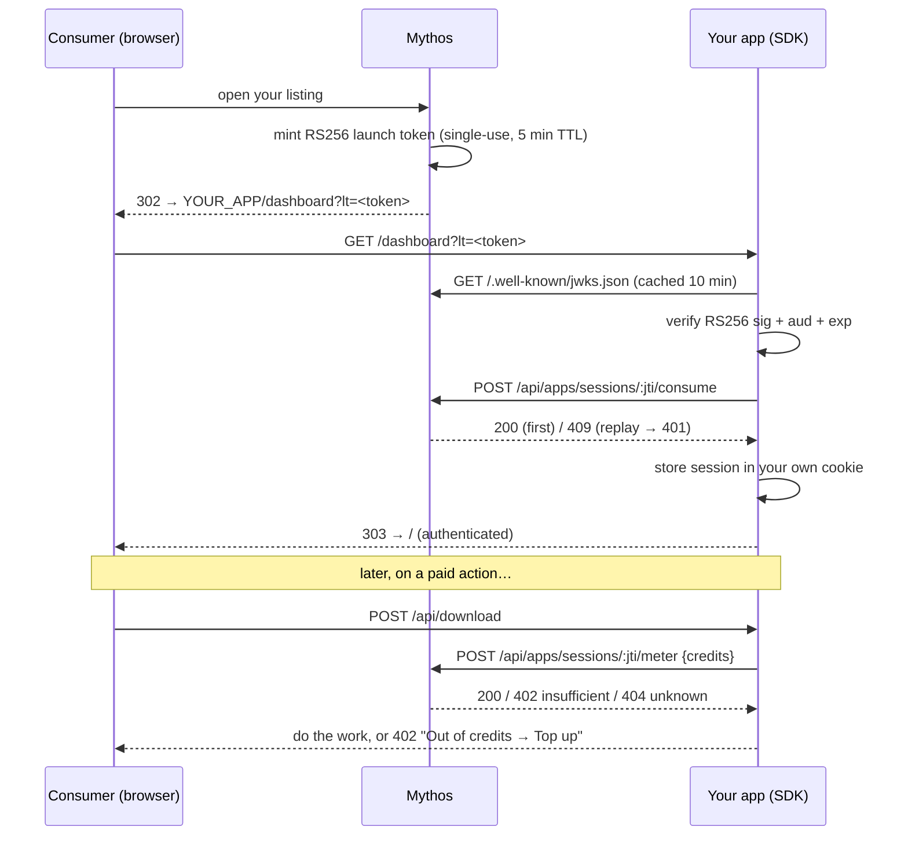

# Integrating with Mythos (the Mythos SDK)

This is how Pluck became a metered Mythos Producer. Adding Mythos to any app is **three hooks**:
a handshake, an auth gate, and a usage meter. Pluck is the Python/FastAPI worked example; the Node
SDK is symmetric.

## 1. Install the SDK

**Python** (Pluck): `pip install mythos-sdk`
```bash
pip install mythos-sdk            # FastAPI / Starlette apps
# (not yet on PyPI — for local dev, install from the Mythos SDK repo:
#  pip install /path/to/mythos-sdk/packages/python)
```
**Node**: `npm install @mythos/sdk` (Express apps).

> **Framework support.** The Python convenience helpers (`require_launch_token`, `handshake_router`)
> are **FastAPI/Starlette-native** — `require_launch_token` is a FastAPI dependency and
> `handshake_router` is a Starlette router. The Node helpers (`requireLaunchToken`, `handshakeRoute`)
> are **Express** middleware/handlers. On any other framework (Flask, Django, Koa, Fastify), drop down
> to the framework-agnostic primitive `verify_launch_token` / `verifyLaunchToken` and wire the
> consume + meter HTTP calls yourself — see [Other frameworks](#other-frameworks) below.

## 2. Configure (point the SDK at Mythos)
Set before the app starts (Pluck does this at the top of `server.py`):
```python
os.environ.setdefault("MYTHOS_API_URL", "http://localhost:4000")          # https://api.mythos.work in prod
os.environ.setdefault("MYTHOS_LISTING_ID", "<your-listing-id>")           # the listing Mythos assigns you
```
| Env var | Meaning |
|---|---|
| `MYTHOS_LISTING_ID` / `MYTHOS_LISTING_IDS` | your listing id(s); the token's `aud` must match |
| `MYTHOS_API_URL` | Mythos API base (defaults to `https://api.mythos.work`) |

## 3. The three hooks

### a) Handshake (publish-time check)
```python
from mythos_sdk import handshake_router
app.include_router(handshake_router)        # GET /.well-known/mythos-handshake -> { ok, sdk_version }
```

### b) Auth — verify + consume the launch token
Mythos redirects the Consumer to `…/dashboard?lt=<token>`. Exchange it **once**, then keep your own
session (launch tokens are single-use):
```python
from fastapi import Depends, Request
from mythos_sdk import require_launch_token, MythosSession

@app.get("/dashboard")
async def dashboard(request: Request, session: MythosSession = Depends(require_launch_token)):
    request.session["mythos"] = asdict(session)     # our own cookie session
    return RedirectResponse("/", status_code=303)

def consumer(request: Request) -> dict:              # gate every protected route
    m = request.session.get("mythos")
    if not m:
        raise HTTPException(401, "Launch from Mythos first")
    return m
```
`require_launch_token` verifies the RS256 signature (via Mythos' JWKS), checks `aud`/`exp`, and calls
`/consume` so the token can't be replayed. `session` has `userId, email, displayName, listingId, sessionJti`.

> Node: `app.get('/dashboard', requireLaunchToken(), (req,res)=>{ req.session.mythos = req.mythos; ... })`

### c) Payment — meter usage
Charge credits for whatever you want to monetise. Pluck charges per download:
```python
from mythos_sdk import report_usage, InsufficientFundsError

@app.post("/api/download")
async def download(req, request: Request):
    m = consumer(request)                                            # AUTH gate
    try:
        await report_usage(m["sessionJti"], credits=2, reason="video-download")   # PAYMENT
    except InsufficientFundsError:
        raise HTTPException(402, "Out of Mythos credits — top up")
    ...                                                              # do the work
```
`report_usage` debits the Consumer's Mythos wallet; `InsufficientFundsError` (402) and
`SessionNotFoundError` (404) are raised when relevant. (Node: `reportUsage(jti, { credits, reason })`.)

## What the SDK calls under the hood
| SDK action | Mythos endpoint |
|---|---|
| verify token | `GET /.well-known/jwks.json` (RS256 keys) |
| single-use | `POST /api/apps/sessions/:jti/consume` (200 first, 409 replay) |
| meter | `POST /api/apps/sessions/:jti/meter` (402 insufficient, 404 unknown) |

## 4. Test locally
A mock Mythos backend (issues launch tokens + JWKS + consume + meter + a wallet) lives at
`../Mythos/mythos-sdk-demo/mock-mythos-backend`:
```bash
(cd ../Mythos/mythos-sdk-demo/mock-mythos-backend && npm install && npm start)   # :4000
python server.py                                                                  # :8000
# open http://localhost:4000 -> "Open Pluck"
```
Then verify (see the root `README.md` table): no-launch → denied; launch → authenticated; replay/tampered
/expired → 401; download → wallet debited; out of credits → 402 → top up.

## Where Pluck implements each piece
| Hook | File |
|---|---|
| config | `server.py:21` (`MYTHOS_API_URL` / `MYTHOS_LISTING_ID` env defaults) |
| session middleware | `server.py:52` (`add_middleware(SessionMiddleware, …)`) |
| handshake | `server.py:53` (`include_router(handshake_router)`) |
| auth gate | `server.py:127` (`consumer()`) / `server.py:602` (`/dashboard`) |
| payment | `server.py:507` (`/api/download` → `report_usage`) |
| credits UI | `static/app.js` (`/api/session`, balance pill, 402 → Top up) |

---

## 5. Putting YOUR app on Mythos — producer checklist

Pluck is the reference implementation. To ship your own Mythos Producer, follow these steps.

### One-time (setup)

1. **Register your app** with Mythos — you get a `LISTING_ID` (UUID) back.
2. **Set env vars** in your deployment:
   ```
   MYTHOS_API_URL=https://api.mythos.work   # production Mythos endpoint
   MYTHOS_LISTING_ID=<your-listing-uuid>
   ```
3. **Install the SDK** for your stack:
   ```bash
   pip install mythos-sdk          # Python / FastAPI / Flask
   npm install @mythos/sdk         # Node / Express
   ```

### Code (three hooks — see §3 above)

| # | What | Pluck reference |
|---|------|-----------------|
| 1 | Mount `handshake_router` (or Node equivalent) | `server.py:53` |
| 2 | Add `/dashboard?lt=` route → `require_launch_token` → save session | `server.py:602` (`/dashboard`) |
| 3 | Gate every protected route: reject if no session | `server.py:127` (`consumer()`) |
| 4 | Call `report_usage` before doing the paid action | `server.py:507` (`/api/download`) |
| 5 | Return **402** on `InsufficientFundsError` and surface a **Top up** link | `server.py:508` + `app.js` |

### Session middleware (Python)

`require_launch_token` reads the session — you must add Starlette's `SessionMiddleware`:
```python
from starlette.middleware.sessions import SessionMiddleware
app.add_middleware(SessionMiddleware, secret_key=os.environ["SESSION_SECRET"])
```
Use a real random secret in production (`python -c "import secrets; print(secrets.token_hex(32))"`).

### What Mythos provides at runtime



Plain-text fallback:

```
Consumer opens your Mythos listing
  → Mythos mints a signed RS256 launch token (single-use, 5 min TTL)
  → redirects to  YOUR_APP/dashboard?lt=<token>
  → SDK verifies signature (JWKS), checks aud/exp, calls /consume (replay guard)
  → your app stores the session (userId, email, displayName, sessionJti)
  → on every paid action: SDK calls /meter to debit the consumer's wallet
  → wallet hits 0 → InsufficientFundsError → 402 → consumer tops up on Mythos
```

### Test with the mock before going live

```bash
# 1. Start mock Mythos
cd Mythos/mythos-sdk-demo/mock-mythos-backend && node server.mjs   # :4000

# 2. Point your app at the mock
export MYTHOS_API_URL=http://localhost:4000
export MYTHOS_LISTING_ID=11111111-1111-1111-1111-111111111111   # mock accepts any UUID
# start your app on :8000

# 3. Add your app as a producer in mock-mythos-backend/server.mjs:
#    const PRODUCERS = { myapp: "http://localhost:8000", ... }
# (then the mock launcher at :4000 shows your app card and can mint tokens for it)

# 4. Open  http://localhost:4000/open/myapp  — redirects in with a valid token
# 5. Verify: no-launch → 401; replay → 401; download → wallet debited; 0 balance → 402
```

### Production checklist

- [ ] `MYTHOS_API_URL` = `https://api.mythos.work`
- [ ] `MYTHOS_LISTING_ID` = your real listing UUID from Mythos dashboard
- [ ] `SESSION_SECRET` = cryptographically random (not the demo value)
- [ ] HTTPS on your app (launch tokens use `aud` tied to your registered domain)
- [ ] Handle `SessionNotFoundError` (404) — session expired or unknown; redirect to Mythos to re-launch
- [ ] `GET /.well-known/mythos-handshake` returns 200 (handshake_router mounted)

---

## 6. Full Node / Express example

The symmetric Pluck equivalent in Express. Same three hooks, same redirect-then-own-session pattern.

```js
import express from 'express';
import session from 'express-session';
import {
  requireLaunchToken, reportUsage, handshakeRoute,
  InsufficientFundsError, SessionNotFoundError,
} from '@mythos/sdk';

// Env (set before boot):
//   MYTHOS_API_URL=https://api.mythos.work   MYTHOS_LISTING_ID=<your-listing-uuid>
const app = express();
app.use(express.json());
app.use(session({
  secret: process.env.SESSION_SECRET,     // random in prod
  resave: false, saveUninitialized: false,
  cookie: { httpOnly: true, secure: true, sameSite: 'lax' },
}));

// (1) handshake — publish-time check
app.get('/.well-known/mythos-handshake', handshakeRoute());

// (2) auth — verify + consume once, then keep your OWN session
app.get('/dashboard', requireLaunchToken(), (req, res) => {
  req.session.mythos = req.mythos;        // { userId, email, displayName, listingId, sessionJti }
  res.redirect(303, '/');
});

// gate every protected route on your own session (NOT the launch token — it's single-use)
function consumer(req, res, next) {
  if (!req.session.mythos) return res.status(401).json({ error: 'Launch from Mythos first' });
  req.consumer = req.session.mythos;
  next();
}

// (3) payment — meter before doing the paid work
app.post('/api/download', consumer, async (req, res) => {
  try {
    await reportUsage(req.consumer.sessionJti, { credits: 2, reason: 'video-download' });
  } catch (e) {
    if (e instanceof InsufficientFundsError) return res.status(402).json({ error: 'Out of credits — top up' });
    if (e instanceof SessionNotFoundError)   return res.status(401).json({ error: 'Re-launch from Mythos' });
    throw e;
  }
  // … do the actual work …
  res.json({ ok: true });
});

app.listen(8000);
```

> The Node `requireLaunchToken()` reads `?lt=`, verifies the RS256 signature against the cached JWKS,
> checks `aud`, and calls `/consume` — identical semantics to the Python `require_launch_token`
> dependency. It populates `req.mythos`; you copy it into your own session and never touch `?lt=` again.

## Other frameworks

The convenience helpers are FastAPI (Python) and Express (Node) only. On anything else, build the
three hooks on top of the framework-agnostic primitive and two plain HTTP calls.

**1. Verify + consume** (do this on the `/dashboard?lt=` landing route):
```python
from mythos_sdk import verify_launch_token        # framework-agnostic
import httpx, os

API = os.environ["MYTHOS_API_URL"]

async def land(lt: str):
    session = await verify_launch_token(lt)        # RS256 + aud/exp; raises on bad token → return 401
    async with httpx.AsyncClient() as c:           # single-use enforcement (do it yourself off-FastAPI)
        r = await c.post(f"{API}/api/apps/sessions/{session.sessionJti}/consume")
    if r.status_code == 409:
        return 401                                 # replay
    # store session.sessionJti + identity in your own session store, redirect to your app
```

**2. Handshake** — just return JSON on `GET /.well-known/mythos-handshake`:
```python
{"ok": True, "sdk_version": "0.1.0"}
```

**3. Meter** — `report_usage(jti, credits=…, reason=…)` works on any framework (it's a plain HTTP
call under the hood); catch `InsufficientFundsError` (402) and `SessionNotFoundError` (404).

The endpoints these map to are in the **"What the SDK calls under the hood"** table in §3.

---

## 7. Troubleshooting

| Symptom | Likely cause | Fix |
|---|---|---|
| Every launch → **401 "Invalid launch token"** | `MYTHOS_LISTING_ID` doesn't match the token's `aud` | Set `MYTHOS_LISTING_ID` to the exact listing UUID Mythos minted the token for (`MYTHOS_LISTING_IDS` for multi-listing) |
| 401 even on a **fresh** token | App pointed at the wrong Mythos, or JWKS unreachable | Check `MYTHOS_API_URL`; confirm `GET {API}/.well-known/jwks.json` returns keys |
| Worked once, then 401 on **refresh** | Launch tokens are single-use; you re-verified `?lt=` instead of using your own session | Save the session on first landing, redirect to a clean URL, gate routes on your session — never re-read `?lt=` |
| 401 right after **key rotation** | Cached JWKS is stale | None needed — SDK caches 10 min and force-refetches on `kid` miss; only fails if the API was unreachable during refetch |
| `report_usage` raises **`SessionNotFoundError`** (404) | Session expired/unknown on Mythos | Redirect the consumer back to Mythos to re-launch |
| `report_usage` always **402** | Consumer wallet is empty | Surface a **Top up** link to their Mythos wallet; in dev use the mock's `/api/wallet/topup` |
| Python: `KeyError`/empty session on `/dashboard` | `SessionMiddleware` not added | `app.add_middleware(SessionMiddleware, secret_key=…)` **before** routes (see §5) |
| `MYTHOS_LISTING_ID ... env var is required` at boot | Neither `MYTHOS_LISTING_ID` nor `MYTHOS_LISTING_IDS` set | Set one before the app imports/starts |
| Handshake check fails at publish time | `handshake_router` / `handshakeRoute()` not mounted | Mount it; confirm `GET /.well-known/mythos-handshake` → `{ ok, sdk_version }` |

**Dev tip — reproduce token failures deterministically** with the mock's fault-injection endpoints
(rotate keys, mint expired/wrong-`aud` tokens, top up wallets); see the fault-injection block in the
root [`README.md`](../README.md).
